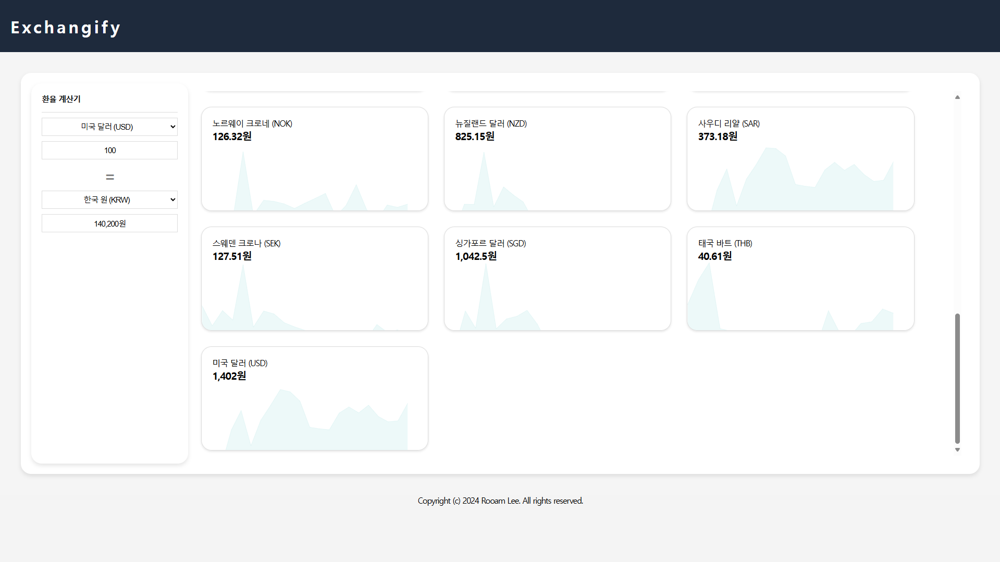
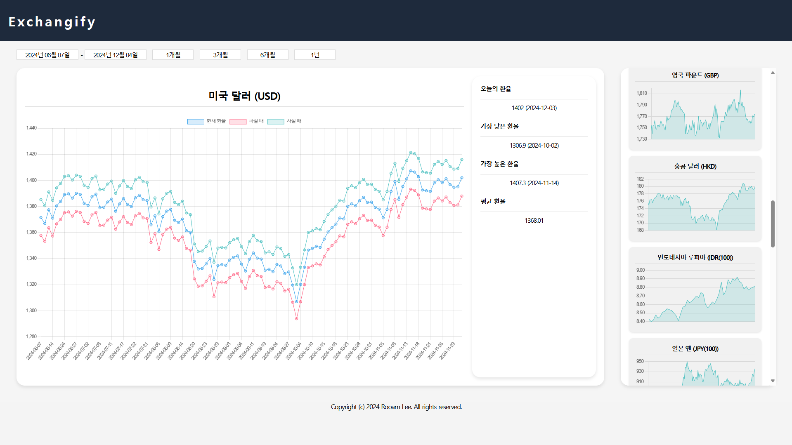

# site.exchangify
Currency exchange rate lookup site based on Korean standards

* Main Page

* Detail Page


## install a Python module
```bash
pip install -r requirements.txt
```

## insert data into the database
```bash
python manage.py makemigrations # Create a database model
python manage.py migrate # Create a database model

python manage.py crawling # Collect data from three months ago based on today
# app/management/commands/crawling.py
```

### if there is no API key for the Korea Eximbank?
```bash
python manage.py loaddata data.json # 20240601 - 20241203
```

## Start the server
```bash
python manage.py runserver
```

http://localhost:8000/

## License

This project uses the following open-source libraries:

- **Chart.js**: A simple yet flexible JavaScript charting library.
  - License: MIT License
  - URL: https://github.com/chartjs/Chart.js

- **flatpickr**: A lightweight, powerful datetime picker.
  - License: MIT License
  - URL: https://github.com/flatpickr/flatpickr

- **jQuery**: A fast, small, and feature-rich JavaScript library.
  - License: MIT License
  - URL: https://github.com/jquery/jquery